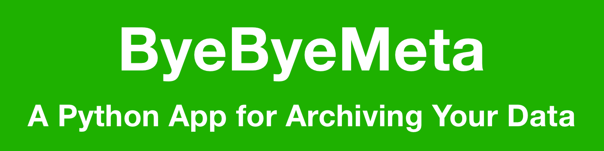

# Facebook/Instagram Data Cleaner
[Background](#background)<br>
[Features](#features)<br>
[Getting your data from Facebook/Instagram](#data)<br>
[Making the Output folder](#outputfolder)<br>
[Getting the script](#script)<br>
[Running the script](#running)<br>
[Viewing your posts](#viewing)<br>
[Adjusting the results](#adjusting)<br>
[Done!](#done)
[URL Options](#options)

## <a name="background"></a>Background
With the moderation changes and general move towards the far-right of Meta's products, I decided it was time to leave. As such, I'm setting up shop on [BlueSky - ubillos.bsky.social](https://bsky.app/profile/ubillos.bsky.social)

But I have quite a bit of history accumulated on Facebook that I don't want to lose. Hence this project. It takes the data download that you can request from Meta for your Facebook and/or Instagram posts and converts them into a single browsable page with a nice navigation bar. The data's internal structure is dramatically simplified and condensed. You can view the archive locally, or easily host it on your own website.

You can see [my Facebook archive hosted on RickAndRandy.com](https://rickandrandy.com/fb/randy/).

Below are instructions for downloading your posts from Facebook/Instagram and for running the ByeByeMeta script. It's a Python script that is run from the command line. This might sound scary, but I'll walk you through the steps. If you can do the download from Facebook/Instagram, I'm pretty sure you can handle running the script.

(The files for this project are also [available on GitHub](https://github.com/rubillos/ByeByeMeta))

**Note:** This script has been tested on a Mac. There is code to handle Windows, but it is untested. If someone tries it on Windows, let me know how it goes!

## <a name="features"></a>Features
* Takes the data dump that you can download from Facebook/Instagram and turns it into a navigable web page where you can see and search all of your posts.
* Merges posts, uncategorized entries, photos, and videos into a single collection.
* Cleans up the HTML significantly
* Provides a navigation bar for quickly getting to any portion of any year.
* Removes duplicate entries.
* Provides a method for omitting specific posts.
* You can see "Memories" - posts with today's month and year by appending "?memories" to the URL.

## <a name="data"></a>Getting your data from Facebook/Instagram
From your Facebook page on a Mac browser:
1. Click you account icon in the uper right corner.
2. Click "Settings & privacy"
3. Click "Settings"
4. Under "Accounts Center" click "See more in Accounts Center"
5. Click "Your information and permissions"
6. Click "Download your information"
7. Click "Download or transfer information"
8. Click the checkbox next to your Facebook/Instagram account that you want to download
9. Click "Next"
10. Click "Specific types of information"
11. Click the "Posts" checkbox
12. Select "Download to device"
13. Click "Date range:, then click "All time", then "Save"
14. Make sure "Format" is set to "HTML"
15. Click "Media quality", then click "High", then "Save"

You'll now see a page saying that your information has been requested. It will take a little time for Facebook/Instagram to process everything, usuualy just a few minutes. You'll get an email and a notification when your data is ready. When you receive it, select the notification, then:

1. Follow the notification and click the "Download" button.
2. Locate the downloaded .zip file and double click it.
3. You should now have a folder named something like "facebook-username-date-someletters" or "instagram-username-date-someletters".

## <a name="script"></a>Getting the script

1. Go to the <a href="https://github.com/rubillos/ByeByeMeta/releases" target="_blank">Releases page on Github</a>
2. If no files are shown below "Assets", click the triangle.
3. Click the `Source code (zip)` link

This should download a file to your computer. Double click the file to un-zip it. The resulting folder is the `Script Folder`, double click it to open it.

## <a name="outputfolder"></a>Making the Output folder

- Create a folder somplace convenient (like on your Desktop) to hold the converted files. Name it something obvious, like `YourLastName-FB-Files`

## <a name="running"></a>Running the script

1. Locate the app "Terminal" in the Utilities folder in the Applications folder; double click it.
2. From the Script folder, drag the file `install-packages.sh` to the Terminal window.
3. Bring the Terminal window to the front and press `return`. This will install necessary libraries.
4. From the Script folder, drag the file `ByeByeMeta.py` to the Terminal window.
5. Bring the Terminal window to the front and press `return`.

You will be presented with two `Open File` dialogs.
- The first one asks you to locate the `your_facebook_activity` or `your_instagram_activity` folder inside the data download folder.
- The second asks you to locate the `Output Folder` you created above.

At this point the script will run, printing out progress information and copying/renaming the media files.

## <a name="viewing"></a>Viewing your posts

When the script is done, inside your `Output Folder` you should have three folders, `assets`, `entries`, and `media`, along with a file named `index.html`. Double clicking the `index.html` file should open it into your browser.

You can use the navigation bar at the left to jump to any portion of any year.

## <a name="adjusting"></a>Adjusting the results

There may be entries that you'd prefer not to have included. For me these were images that were used as heading for events I made.

To omit these you just need to find the "entry numbers". Hold down the option key as you move the mouse over the entry you'd like to omit. It's "entry number" will show at the top center of the entry. Make a note of this number.

Once you have a list of entry numbers to omit, you can re-run the ByeByeMeta script:

1. Bring the Terminal window to the front.
2. Press the `up-arrow` - this will show the previous command that was run.
3. Type a space, followed by `-x`, followed by a space and then type in the entry numbers that you'd like to omit, separated by commas. There should be only numbers and commas in this list, no additional spaces. You can use the arrow and delete keys to edit the line. It should look something like:
```
/Users/randy/Downloads/ByeByeMeta-1.0.0/ByeByeMeta.py -x 10,11,12,118,119,188,260
```
4. Press `return`.

The script will run again, omitting the specified entries. Once it has finished you can refresh the browser page, or double click `index.html` again. The specified entries should no longer be included on the page.

You can repeat steps 1 through 4 above, editing the list of omitted entries as desired to curate your final page.

## <a name="done"></a>Done!
You now have an archive of your Facebook/Instagram posts that you can look at locally on your computer, or you can host it on the web through a hosting provider.

You can drag the red line along the left edge to navigate through the years.

You can click on the header to toggle viewing "Memories" - entries that match the current month and day.

## <a name="options"></a>URL Options
There are a couple of options that can be added to the URL in the browser. These are added after a '?' at the end of the URL and multiple can be added, separated by a '&'.

**memories** - Causes only the entries with month and day matching the current month and day to be shown.
**offset=N** - Adjusts the month/day used for memories by a number of days specified by 'N', which can be positive or negative.
**day=M/D** - Sets the month day for the memories to be shown, where 'M' is the month and 'D' is the day.

For example:
```
https://rickandrandy.com/fb/randy/index.html?memories&day=01/10
```
would show memories for January 10th.
